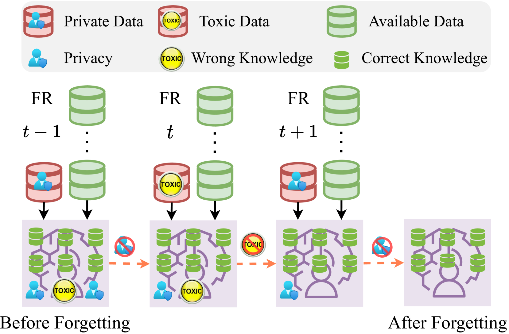
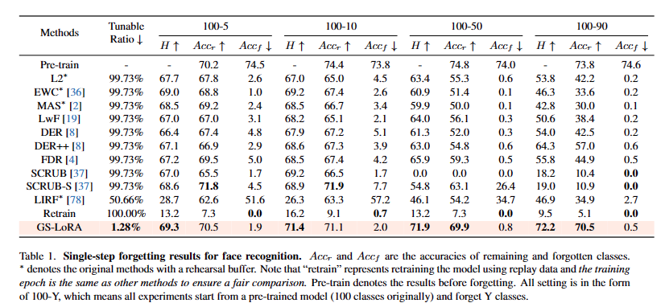
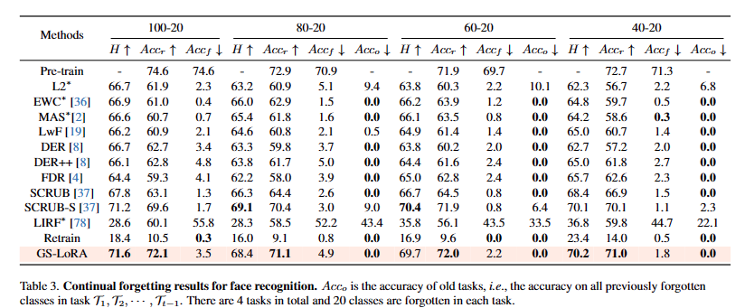

# Continual Forgetting for Pre-trained Vision Models (CVPR2024)



This is the official implementation of ***GS-LoRA*** (CVPR 2024). GS-LoRA is effective, parameter-efficient, data-efficient, and easy to implement continual forgetting, where selective information is expected to be *continuously* removed from a pre-trained model while maintaining the rest. The core idea is to use LoRA combining *group* *Lasso* to realize fast model editing. For more details, please refer to:

**Continual Forgetting for Pre-trained Vision Models [[paper](https://arxiv.org/abs/2403.11530)] [[video](https://www.youtube.com/watch?v=yigUY5v1Rgc)] [[video in bilibili]( https://www.bilibili.com/video/BV1wi421C7PQ/?share_source=copy_web&vd_source=7bb418d0ef24f46374712edc865ed254)]**

[‪Hongbo Zhao](https://scholar.google.com/citations?user=Gs22F0UAAAAJ&hl=zh-CN), Bolin Ni, [‪Junsong Fan‬](https://scholar.google.com/citations?user=AfK4UcUAAAAJ&hl=zh-CN&oi=sra), [‪Yuxi Wang‬](https://scholar.google.com/citations?user=waLCodcAAAAJ&hl=zh-CN&oi=sra), [‪Yuntao Chen‬](https://scholar.google.com/citations?hl=zh-CN&user=iLOoUqIAAAAJ), [‪Gaofeng Meng](https://scholar.google.com/citations?hl=zh-CN&user=5hti_r0AAAAJ), [‪Zhaoxiang Zhang‬](https://scholar.google.com/citations?hl=zh-CN&user=qxWfV6cAAAAJ)

## Experimental results

### Single-step Forgetting



### Continual Forgetting



## Getting Started

### Installation

#### a. Clone this repository

```bash
https://github.com/bjzhb666/GS-LoRA.git
cd GS-LoRA
```

#### b. Install the environment

```bash
conda create -n GSlora python=3.9
pip install -r requirements.txt
```

#### c. Prepare the datasets

```bash
mkdir data
cd data
unzip data.zip
```

You can get our CASIA-100 in [https://drive.google.com/file/d/16CaYf45UsHPff1smxkCXaHE8tZo4wTPv/view?usp=sharing](https://drive.google.com/file/d/16CaYf45UsHPff1smxkCXaHE8tZo4wTPv/view?usp=sharing), and put it in the data folder.

Note: CASIA-100 is a subdataset from  [CASIA-WebFace](https://paperswithcode.com/dataset/casia-webface). We have already split the train/test dataset in our google drive.

## Pretrain a Face Transformer

```bash
mkdir result
cd result
```

You can use our [pre-trained Face Transformer](https://drive.google.com/file/d/1kGo2eor-AYEMruyxI6_oEOegee6VB2_D/view?usp=sharing) directly. Download the pre-trained weight and put it into the result folder

**Or** you can train your own pre-trained models.

Your result folder should be like this:

```bash
result
└── ViT-P8S8_casia100_cosface_s1-1200-150de-depth6
    ├── Backbone_VIT_Epoch_1110_Batch_82100_Time_2023-10-18-18-22_checkpoint.pth
    └── config.txt
```

Code is in `run_sub.sh`

```bash
bash scripts/run_sub.sh
```

`test_sub.sh` is the test code for our Face Transformer. You can test the pre-trained model use it.

```bash
bash scripts/test_sub.sh
```

## Continual Forgetting and Single Step Forgetting

### a. Continual Forgetting

**We provide the code of all baselines and our method GS-LoRA metioned in our paper.**

In `run_cl_forget.sh`, **LIRF, SCRUB, EWC, MAS, L2, DER, DER++, FDR, LwF, Retrain and GS-LoRA** (**Main Table**)

### b. Single-step forgetting

For baseline methods, you can still use `run_cl_forget.sh` and change `--num_tasks` to 1. (There are examples in `run_cl_forget.sh`.)

**For GS-LoRA, we recommend you to use `run_forget.sh`.** Some exploration Experiment like the **data ratio, group strategy, scalablity, $\beta$ ablation** code can also be found in this script.

## Citation

If you find this project useful in your research, please consider citing:

```
@article{zhao2024continual,
  title={Continual Forgetting for Pre-trained Vision Models},
  author={Zhao, Hongbo and Ni, Bolin and Wang, Haochen and Fan, Junsong and Zhu, Fei and Wang, Yuxi and Chen, Yuntao and Meng, Gaofeng and Zhang, Zhaoxiang},
  journal={arXiv preprint arXiv:2403.11530},
  year={2024}
}
```

## Contact

Please contact us or post an issue if you have any questions.

## Acknowledgement

This work is built upon the [zhongyy/Face-Transformer: Face Transformer for Recognition (github.com)](https://github.com/zhongyy/Face-Transformer)

## License

This project is released under the [MIT License](https://github.com/bjzhb666/GS-LoRA/blob/master/LICENSE).
